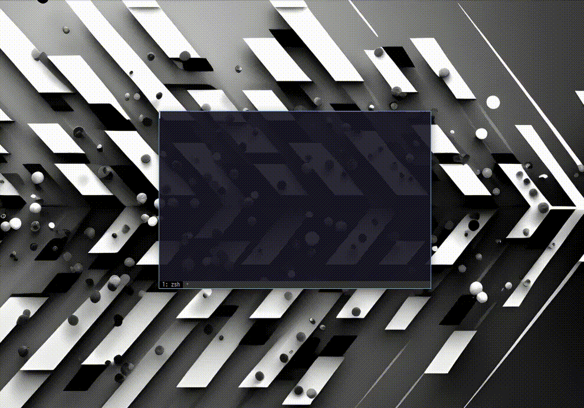

<!--
<h1 align="center">
  <a href="https://github.com/digitallyserviced/fxcapview">

    
  </a>
</h1>
-->
<div align="center">
<div align="center">

</div>
  <br />
  <a href="#about"><strong>Explore the screenshots »</strong></a>
  <br />
  <br />
  <a href="https://github.com/digitallyserviced/fxcapview/issues/new?assignees=&labels=bug&template=01_BUG_REPORT.md&title=bug%3A+">Report a Bug</a>
  ·
  <a href="https://github.com/digitallyserviced/fxcapview/issues/new?assignees=&labels=enhancement&template=02_FEATURE_REQUEST.md&title=feat%3A+">Request a Feature</a>
  .
  <a href="https://github.com/digitallyserviced/fxcapview/issues/new?assignees=&labels=question&template=04_SUPPORT_QUESTION.md&title=support%3A+">Ask a Question</a>
</div>

<div align="center">
<br />
  
[](LICENSE)

[](https://github.com/digitallyserviced/fxcapview/issues?q=is%3Aissue+is%3Aopen+label%3A%22help+wanted%22)

[](https://github.com/digitallyserviced)

</div>

# FX Preview Capture Testing Toolkit 

Try out what your sketch will look like when run through the preview/capture process. 

<details open="open">
<summary>Table of Contents</summary>

- [About](#about)
  - [Features](#features)
- [Getting Started](#getting-started)

- [Support](#support)
- [Project assistance](#project-assistance)
- [Contributing](#contributing)
- [Authors & contributors](#authors--contributors)
- [License](#license)
- [Acknowledgements](#acknowledgements)

</details>

---

## About

   When unique iterations are minted, fxhash signing module needs to generate some metadata to attach to the NFTs for them to appear as valid on the tezos ecosystem. 

   Some part of the metadata is an image, and so the signing module needs to load your code in a webpage, and somehow extract a capture. 

   Because there are a wide variety of projects, we use a chrome lambda instance to run a headless browser that opens your Generative Token URL and loads the JS. Ultimately it captures a view of the Token that must be controlled and setup by the publisher to ensure that it is taken properly.

  ### (fx)hash docs

  - [(fx)hash project settings](https://www.fxhash.xyz/doc/artist/project-settings)  
    - [capture settings](https://www.fxhash.xyz/doc/artist/project-settings#capture-settings) font parser and console text renderer. This utility was inspired by the 
### Built With

> Go 1.18
> Neovim
> Arch Linux

## Getting Started

### Prerequisites

> Go 1.18
> Linux
> [Gum](https://github.com/charmbracelet/gum)

### Installation

> **[?]**
> Clone the repo and get started

```bash
git clone https://github.com/digitallyserviced/fxcapview.git
cd fxcapview
./preview
```

## Support

Reach out to the maintainer at one of the following places:

- [GitHub issues](https://github.com/digitallyserviced/fxcapview/issues/new?assignees=&labels=question&template=04_SUPPORT_QUESTION.md&title=support%3A+)
- Contact options listed on [this GitHub profile](https://github.com/digitallyserviced)
- FxHash Discord [discord](https://discord.com/invite/fxhash)

## Project assistance

If you want to say **thank you** or/and support active development of FXCAPVIEW:

- Add a [GitHub Star](https://github.com/digitallyserviced/fxcapview) to the project.
- Tweet about the FXCAPVIEW.
- Write interesting articles about the project on [Dev.to](https://dev.to/), [Medium](https://medium.com/) or your personal blog.

Together, we can make FXCAPVIEW **better**!

## Contributing

First off, thanks for taking the time to contribute! Contributions are what make the open-source community such an amazing place to learn, inspire, and create. Any contributions you make will benefit everybody else and are **greatly appreciated**.

## Authors & contributors

The original setup of this repository is by [DigitallyServiced](https://github.com/digitallyserviced).

For a full list of all authors and contributors, see [the contributors page](https://github.com/digitallyserviced/fxcapview/contributors).

## License

This project is licensed under the **Creative Commons**.

See [LICENSE](LICENSE) for more information.

## Acknowledgements

> The CLI utility [tdfiglet](https://github.com/tat3r/tdfiglet) which introduced me to TheDraw fonts

> The great CLI editor [Neovim](https://github.com/neovim/neovim) which allows me to ditch a mouse

> The great [wezterm](https://github.com/wez/wezterm) terminal emulator which is beautiful and acts as my WM, status bar, modal dialogs, my everything...

> [RoySAC](http://roysac.com/) for [TheDraw Font File Spec](http://www.roysac.com/blog/2014/04/thedraw-fonts-file-tdf-specifications/) and fonts and other great info about ASCII/ANSI art. As well as his [Font Utility](https://sourceforge.net/p/ansi-text-editor/svn/HEAD/tree/ANSI-EditorSDK/Classes/Fonts/TDF/TDFFontFile.vb) which provided me some code insight into the font file definition.

> [WAB Ansi Logo Maker](https://github.com/N0NameN0/WAB_Ansi_Logo_Maker/blob/main/index.php) which also had inisght into the TheDraw font spec in javascript

> [textimg](https://github.com/jiro4989/textimg) for making renderings of the fonts in images

> [asciinema](https://github.com/asciinema/asciinema) for the console recorder to make the preview gifs

> [asciinema gif generator](https://github.com/asciinema/agg) for the asciinema asciicast gif generator

> [EdenEast nightfox color schemes](https://github.com/EdenEast/nightfox.nvim) for terafox and carbonfox themes that all the images/gifs use as the wezterm console color schemes

# TODO

* make some more tests with random tokens
* create S3 bucket to store results (expire 1 day)
* implement the save on S3 bucket
* save image to docker hub
* deploy on AWS Batch
* test jobs manually
* implement sending jobs with the proxy
* make some tests with the proxy
* update the rest of the file-api / front-end to use the new module instead


# Environment variables to configure on AWS Batch

* `AWS_S3_REGION`: the region of the bucket
* `AWS_S3_BUCKET`: the bucket identifier
